# Architecture & Engineering Overview

<p align="center">
  <a href="../README.md"><b>README</b></a> •
  <a href="../DEVELOPER_GUIDE.md"><b>Developer Guide</b></a> •
  <a href="input-format.md"><b>Input Formats</b></a> •
  <a href="security.md"><b>Security</b></a> •
  <a href="development.md"><b>Development</b></a>
</p>

---

The **DefFileGenerator** project is engineered as a high-performance, modular Python engine designed to parse industrial Modbus register documentation in heterogeneous unstructured formats (**PDF, Excel, CSV, XML**) and produce validated, structured WebdynSunPM definition files (`.csv`).

---

## 🏛️ System Architecture Diagram

```mermaid
flowchart TD
    subgraph Input["📥 Heterogeneous Source Files"]
        A1["📄 PDF (pdfplumber Tables)"]
        A2["📊 Excel (openpyxl read_only)"]
        A3["📑 CSV (Sniffer / Multi-Encoding)"]
        A4["🏷️ XML (defusedxml anti-XXE)"]
    end

    subgraph Extractor["⚙️ Extraction Module (extractor.py)"]
        B1["Smart Header Detection & Keyword Scoring"]
        B2["Multi-Row Header Banner Merging"]
        B3["Tiered Column Mapping (Exact > Synonym > Partial > PDF Glyphs)"]
        B4["Streaming Row Dict Generators"]
    end

    subgraph Generator["🔧 Normalization Engine (def_gen.py)"]
        C1["Address Normalization (Hex, Decimal, Ranges)"]
        C2["Data Type Standardization (U16, I32, F32, BITS, Endian)"]
        C3["Linear Scaling Coefficients (CoefA, CoefB)"]
        C4["Unique Tag Synthesis"]
    end

    subgraph Validation["🛡️ Validation & Security Layer"]
        D1["O(log N) Bisect Interval Address Overlap Check"]
        D2["Bit-Slice Constraints (startbit 0..15, length 1..16)"]
        D3["CSV Formula Injection Escaping"]
    end

    subgraph Output["💾 Atomic Persistence & Public Surfaces"]
        E1["Staged Sibling File (.tmp)"]
        E2["fsync() + os.replace() Atomic Rename"]
        E3["Validated WebdynSunPM CSV (UTF-8 BOM)"]
    end

    Input --> Extractor
    Extractor --> Generator
    Generator --> Validation
    Validation --> Output
```



---

## 🏗️ Detailed Component Data Flow

```text
[ PDF / Excel / CSV / XML ]
            │
            ▼
┌────────────────────────────────────────────────────────┐
│  DefFileGenerator/extractor.py                         │
│  - Multi-page table extraction via pdfplumber          │
│  - Stream buffer ingestion (avoids OS file locks)      │
│  - Smart header detection & Modbus keyword scoring     │
│  - Multi-row header banner merging                     │
│  - Exact -> synonym -> partial -> PDF glyph fallback   │
└───────────────────────────┬────────────────────────────┘
                            │ Yields intermediate register dicts
                            ▼
┌────────────────────────────────────────────────────────┐
│  DefFileGenerator/def_gen.py                           │
│  - Address Normalization (Hex 0x..., Decimal, Ranges)  │
│  - Data Type Standardization (U16, I32, F32, Endian)   │
│  - BITS compound slicing (address_startbit_length)     │
│  - O(log N) Bisect Register Overlap Detection          │
│  - Linear Scaling (CoefA = Factor * 10^Scale, CoefB)   │
│  - CSV Injection Escaping & Control Character Stripping │
└───────────────────────────┬────────────────────────────┘
                            │ Atomic disk persistence
                            ▼
┌────────────────────────────────────────────────────────┐
│  Output Layer (Atomic Staging & fsync)                 │
│  - Writes to hidden staging file: .{name}.{uuid}.tmp   │
│  - Explicit flush and physical disk sync via os.fsync  │
│  - Atomic replacement via os.replace                   │
└───────────────────────────┬────────────────────────────┘
                            │
        ┌───────────────────┼───────────────────┐
        ▼                   ▼                   ▼
┌───────────────┐   ┌───────────────┐   ┌───────────────┐
│  CLI (main)   │   │  FastAPI Web  │   │  Windows GUI  │
│  deffilegen   │   │  web/app.py   │   │  gui.py       │
└───────────────┘   └───────────────┘   └───────────────┘
```

---

## ⚡ Key Architectural Invariants

1. **Streaming-Oriented Pipeline**: CSV, XML, and mapped rows use generator pipelines (`yield`) to minimize memory footprints.
2. **Strict Determinism**: Generated output files are guaranteed to be byte-identical across runs with identical inputs, unaffected by `PYTHONHASHSEED`.
3. **Decoupled Responsibilities**: 
   - `extractor.py` handles document parsing and column mapping heuristics.
   - `def_gen.py` handles data type semantics, address normalization, overlap checks, and CSV serialization.
   - Entry points (`main.py`, `gui.py`, `web/app.py`) depend on the core engine, never vice-versa.
4. **Defensive Parsing at System Boundaries**: Malformed XML entities, CSV formula injection attempts, and control characters are neutralized before reaching state.
5. **Conservative Completeness**: The pipeline never fabricates missing addresses. Scanned PDFs require external OCR.

---

## 🌐 Public Surfaces & Entry Points

| Module / Script | Interface | Primary Purpose |
|---|---|---|
| [`DefFileGenerator/main.py`](../DefFileGenerator/main.py) | CLI (`deffilegen`) | Command-line interface (`run`, `extract`, `generate`, `validate`, `gui`) |
| [`DefFileGenerator/gui.py`](../DefFileGenerator/gui.py) | Desktop GUI (`deffilegen-gui`) | Native Windows 11 CustomTkinter application with live preview |
| [`web/app.py`](../web/app.py) | REST API / Web App | FastAPI backend and bundled modern HTML5/CSS3 frontend |
| [`generate_webdyn_def.py`](../generate_webdyn_def.py) | Programmatic API | Primary Python API function: `generate_webdyn_definition(...)` |
| [`doc_to_webdyn.py`](../doc_to_webdyn.py) | Legacy CLI wrapper | Backward compatibility wrapper maintained for legacy scripts |

---

<p align="center">
  <a href="../README.md"><b>⬅ Back to README</b></a> •
  <a href="input-format.md"><b>Input Formats & Columns ➡</b></a>
</p>
